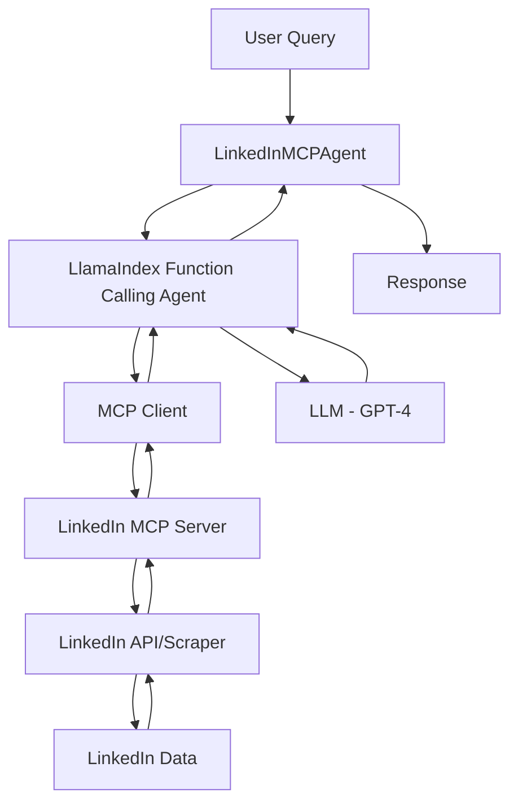

# LinkedIn MCP Server + LlamaIndex Integration

This project integrates the [LinkedIn MCP Server](https://github.com/stickerdaniel/linkedin-mcp-server) with [LlamaIndex](https://www.llamaindex.ai/) to create AI agents that can interact with LinkedIn data through the Model Context Protocol (MCP).

## 🎯 Features

- **LinkedIn Profile Scraping**: Get detailed information from LinkedIn profiles including work history, education, skills, and connections
- **Company Analysis**: Extract comprehensive company information from LinkedIn company pages
- **Job Search**: Search for jobs with filters like keywords and location
- **Recommended Jobs**: Get personalized job recommendations based on your LinkedIn profile
- **Job Analysis**: Retrieve and analyze specific job posting details
- **AI Agent Integration**: Use LlamaIndex function calling agents to interact with LinkedIn data naturally

## 📋 Prerequisites

Before getting started, you'll need:

1. **LinkedIn MCP Server**: Running instance of the LinkedIn MCP server
2. **LinkedIn Cookie**: Your LinkedIn session cookie (`li_at` value)
3. **OpenAI API Key**: For the LLM agent
4. **Python 3.8+**: Python environment

## 🚀 Quick Start

### 1. Install Dependencies

```bash
pip install -r requirements.txt
```

### 2. Set Up LinkedIn MCP Server

You have several options for running the LinkedIn MCP server:

#### Option A: Docker (Recommended)
```bash
docker run -p 8000:8000 -e LINKEDIN_COOKIE="your_li_at_cookie" stickerdaniel/linkedin-mcp-server
```

#### Option B: uvx (Quick Install)
```bash
uvx --from git+https://github.com/stickerdaniel/linkedin-mcp-server linkedin-mcp-server --cookie "your_li_at_cookie"
```

#### Option C: Local Setup
```bash
git clone https://github.com/stickerdaniel/linkedin-mcp-server
cd linkedin-mcp-server
pip install -e .
linkedin-mcp-server --cookie "your_li_at_cookie"
```

### 3. Get Your LinkedIn Cookie

1. Open LinkedIn and log in
2. Open Chrome DevTools (F12 or right-click → Inspect)
3. Go to Application > Storage > Cookies > https://www.linkedin.com
4. Find the cookie named `li_at`
5. Copy the Value field
6. Use this value as your `LINKEDIN_COOKIE`

### 4. Configure Environment Variables

Create a `.env` file in the project root:

```env
# Required
OPENAI_API_KEY=your_openai_api_key_here

# Optional (defaults shown)
LINKEDIN_MCP_URL=http://127.0.0.1:8000/mcp
LLM_MODEL=gpt-4
LLM_TEMPERATURE=0.7
AGENT_VERBOSE=true
AGENT_MAX_ITERATIONS=10
```

### 5. Run the Integration

```bash
# Run basic examples
python linkedin_mcp_llamaindex_integration.py

# Run advanced examples
python examples.py
```

## 💻 Usage

### Basic Usage

```python
import asyncio
from linkedin_mcp_llamaindex_integration import LinkedInMCPAgent

async def main():
    # Create and initialize the agent
    agent = LinkedInMCPAgent()
    await agent.initialize()
    
    # Get recommended jobs
    response = await agent.get_my_recommended_jobs()
    print(response)
    
    # Research a profile
    profile_insights = await agent.get_profile_insights(
        "https://www.linkedin.com/in/example/"
    )
    print(profile_insights)
    
    # Clean up
    await agent.close()

asyncio.run(main())
```

### Advanced Usage

#### Custom Configuration

```python
from linkedin_mcp_llamaindex_integration import LinkedInMCPAgent

agent = LinkedInMCPAgent(
    mcp_server_url="http://localhost:8000/mcp",
    llm_model="gpt-4-turbo-preview",
    api_key="your_api_key",
    allowed_tools=[
        "get_person_profile",
        "search_jobs",
        "get_recommended_jobs"
    ]
)
```

#### Stream Responses

```python
async def stream_example():
    agent = LinkedInMCPAgent()
    await agent.initialize()
    
    async for chunk in agent.stream_chat("Find ML engineer jobs in NYC"):
        print(chunk, end="", flush=True)
    
    await agent.close()
```

#### Interactive Chat

```python
async def interactive_session():
    agent = LinkedInMCPAgent()
    await agent.initialize()
    
    while True:
        user_input = input("You: ")
        if user_input.lower() in ['quit', 'exit']:
            break
        
        response = await agent.chat(user_input)
        print(f"Agent: {response}")
    
    await agent.close()
```

## 📚 Available Tools

The agent has access to these LinkedIn MCP tools:

- `get_person_profile`: Get detailed LinkedIn profile information
- `get_company_profile`: Extract company information
- `get_job_details`: Retrieve specific job posting details
- `search_jobs`: Search for jobs with filters
- `get_recommended_jobs`: Get personalized job recommendations
- `close_session`: Clean up browser resources

## 🎓 Use Cases

### Career Research
Research multiple LinkedIn profiles and generate comparative analyses:

```python
response = await agent.chat("""
    Research these profiles and compare their career paths:
    - https://www.linkedin.com/in/profile1/
    - https://www.linkedin.com/in/profile2/
""")
```

### Job Market Analysis
Analyze job markets for specific roles:

```python
response = await agent.chat("""
    Search for 'Data Scientist' positions in 'San Francisco' 
    and analyze the common skills required
""")
```

### CV Optimization
Get suggestions to improve your CV for specific jobs:

```python
response = await agent.chat("""
    Analyze this job posting: https://www.linkedin.com/jobs/view/123456
    and suggest how I can improve my CV to match it
""")
```

### Company Research
Deep dive into companies for partnerships or job opportunities:

```python
response = await agent.get_company_insights(
    "https://www.linkedin.com/company/example/"
)
```

## 🛠️ Architecture



## 📁 Project Structure

```
grad_search/
├── linkedin_mcp_llamaindex_integration.py  # Main integration module
├── config.py                                # Configuration management
├── examples.py                              # Advanced usage examples
├── requirements.txt                         # Python dependencies
└── README.md                                # This file
```

## 🔧 Configuration Options

| Environment Variable | Description | Default |
|---------------------|-------------|---------|
| `OPENAI_API_KEY` | OpenAI API key (required) | - |
| `LINKEDIN_MCP_URL` | LinkedIn MCP server URL | `http://127.0.0.1:8000/mcp` |
| `LINKEDIN_COOKIE` | LinkedIn session cookie | - |
| `LLM_MODEL` | LLM model to use | `gpt-4` |
| `LLM_TEMPERATURE` | Temperature for responses | `0.7` |
| `AGENT_VERBOSE` | Enable verbose logging | `true` |
| `AGENT_MAX_ITERATIONS` | Max agent iterations | `10` |

## 🚨 Important Notes

1. **Cookie Expiration**: LinkedIn cookies expire after ~30 days. Update your cookie when needed.
2. **Rate Limiting**: Be mindful of LinkedIn's rate limits. Avoid excessive requests.
3. **Privacy**: Handle LinkedIn data responsibly and respect user privacy.
4. **Terms of Service**: Ensure compliance with LinkedIn's Terms of Service.

## 🤝 Contributing

Contributions are welcome! Please feel free to submit a Pull Request.

## 📝 License

This project is provided as-is for educational and research purposes.

## 🙏 Acknowledgements

- [LinkedIn MCP Server](https://github.com/stickerdaniel/linkedin-mcp-server) by stickerdaniel
- [LlamaIndex](https://www.llamaindex.ai/) for the MCP integration framework
- [Model Context Protocol](https://modelcontextprotocol.io/) specification

## 📖 Additional Resources

- [LinkedIn MCP Server Documentation](https://github.com/stickerdaniel/linkedin-mcp-server)
- [LlamaIndex MCP Documentation](https://developers.llamaindex.ai/python/examples/tools/mcp/)
- [Model Context Protocol Docs](https://modelcontextprotocol.io/)

## 🆘 Troubleshooting

### Connection Issues
If you can't connect to the MCP server:
1. Verify the server is running: `curl http://127.0.0.1:8000/mcp`
2. Check the `LINKEDIN_MCP_URL` environment variable
3. Ensure no firewall is blocking the connection

### Cookie Issues
If you get authentication errors:
1. Get a fresh LinkedIn cookie
2. Verify the cookie format (should be the `li_at` value only)
3. Ensure the cookie hasn't expired

### Import Errors
If you get import errors:
1. Install all dependencies: `pip install -r requirements.txt`
2. Verify Python version ≥ 3.8
3. Check virtual environment activation

## 📧 Contact

For issues and questions:
- LinkedIn MCP Server: [GitHub Issues](https://github.com/stickerdaniel/linkedin-mcp-server/issues)
- LlamaIndex: [Discord Community](https://discord.gg/dGcwcsnxhU)
